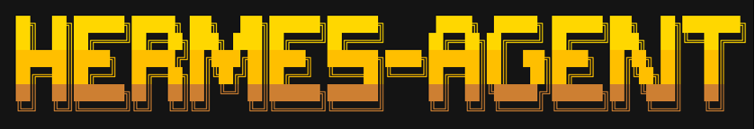
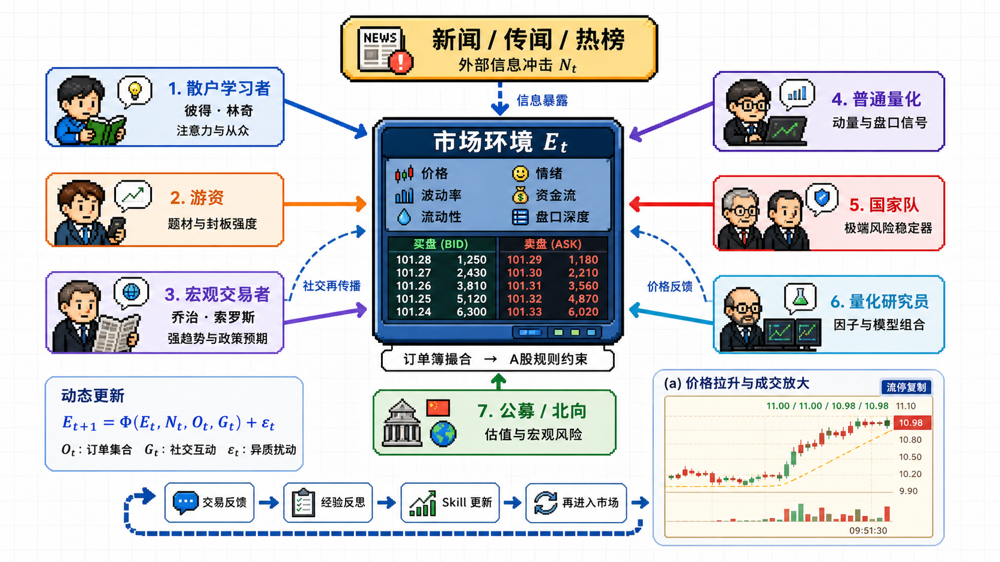
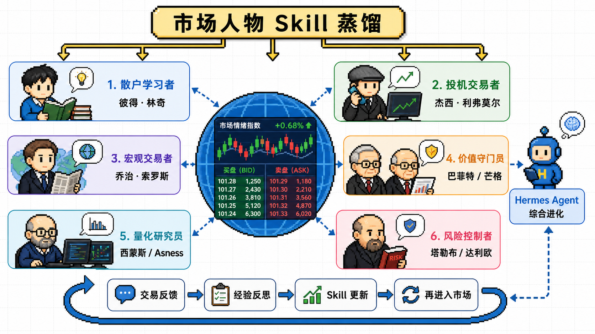
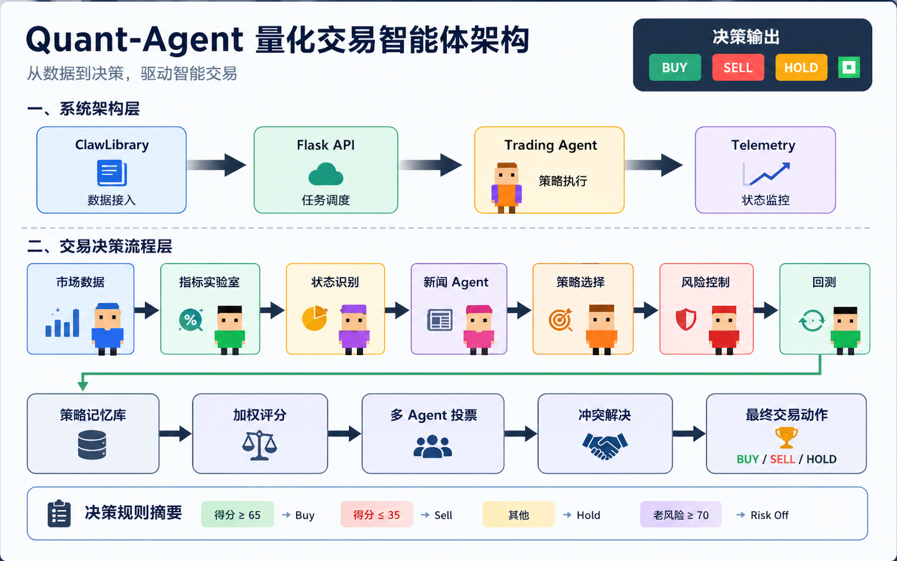
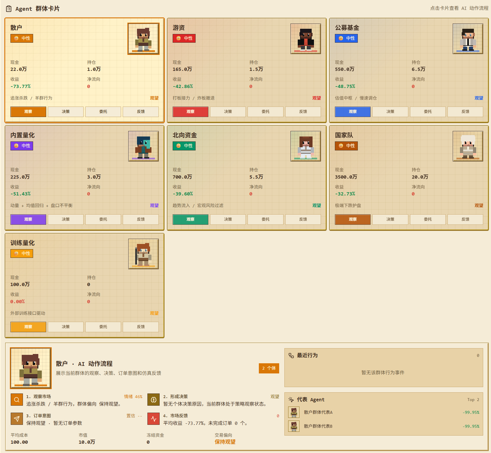
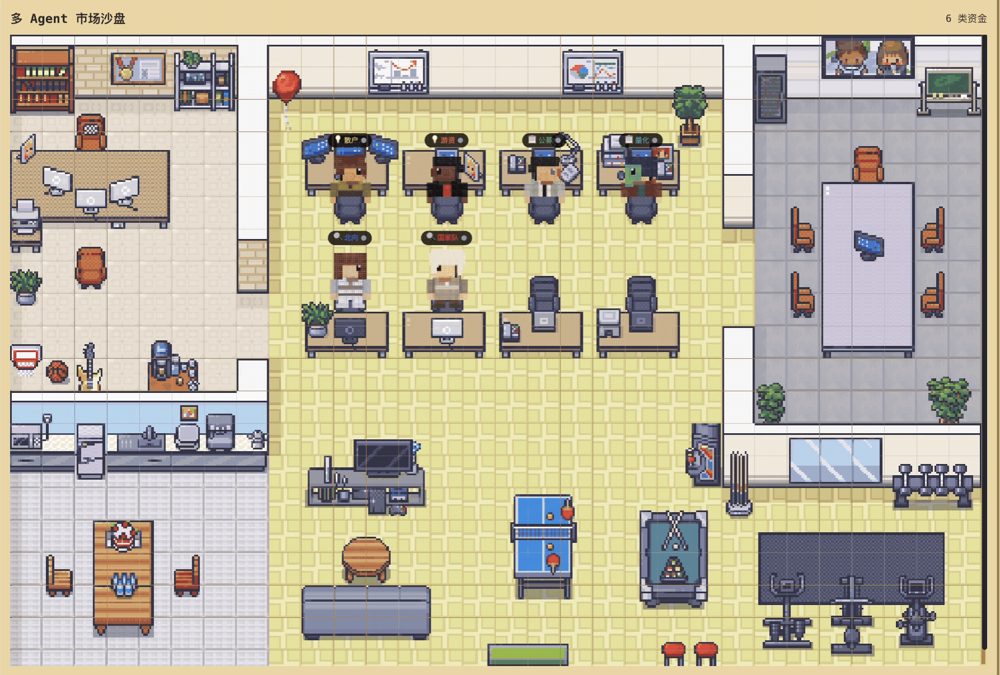
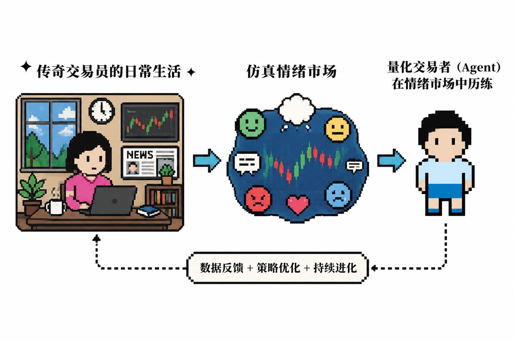
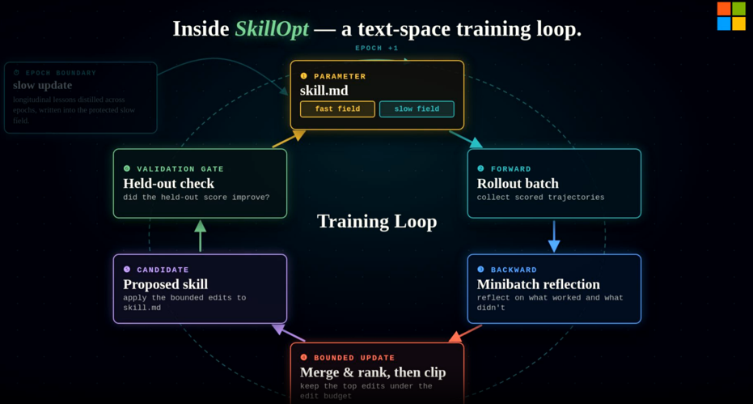

<div align="center">



# Hermes-EM

**情绪市场 + Hermes Agent 的多 Agent 金融仿真与算法交易系统**

<p>
  <a href="https://github.com/HanaViolet/Hermes-EM"></a>
  
  
  
</p>

<p>
  <a href="#系统概览">系统概览</a> |
  <a href="#项目结构">项目结构</a> |
  <a href="#本地部署">本地部署</a> |
  <a href="#运行检查">运行检查</a> |
  <a href="#自测命令">自测命令</a>
</p>

</div>



## 系统概览

Hermes-EM 面向两份课程报告中的核心需求：一方面构建一个由异质投资者、社交传播、订单簿和外部新闻共同驱动的情绪市场；另一方面提供 Hermes Agent 算法交易工作台，用统一的分析流水线完成数据读取、指标计算、策略生成、风险约束、回测复盘和经验更新。

项目代码由三个部分组成：

| 模块 | 路径 | 作用 |
|---|---|---|
| 情绪市场与多 Agent 仿真 | `gru-ai/` | React + Vite 前端，Node.js 后端，包含 A 股式订单簿、异质 Agent、新闻冲击、社交传播和人物 Skill 蒸馏 |
| Hermes 算法交易工作台 | `quant-agent/` | Flask 后端 + ClawLibrary 像素前端，包含策略分析、回测报告、情绪市场训练工具和 SkillOpt 自进化 |
| 达尔文.SKILL 方法库 | `darwin-skill/` | 本地集成的 Darwin.SKILL，来源于 [alchaincyf/darwin-skill](https://github.com/alchaincyf/darwin-skill)，用于 Skill 评估、改进和保留机制 |

## 系统展示

下列视图概括了 Hermes-EM 的核心设计：异质 Agent 的市场交互、Hermes 交易决策链路、可视化沙盘，以及面向策略经验沉淀的 SkillOpt 自进化机制。

<table>
  <tr>
    <td width="50%">
      
      <br/>
      <b>市场人物 Skill 蒸馏</b>
      <br/>
      将散户、游资、公募、北向、国家队、量化研究员等市场角色抽象为可复用的行为 Skill。
    </td>
    <td width="50%">
      
      <br/>
      <b>Hermes Quant Agent 架构</b>
      <br/>
      从行情、新闻、策略、风险和回测结果中生成可解释的交易决策。
    </td>
  </tr>
  <tr>
    <td width="50%">
      
      <br/>
      <b>Agent 群体卡片</b>
      <br/>
      以卡片方式展示不同投资者群体的现金、持仓、收益、净流向和行为状态。
    </td>
    <td width="50%">
      
      <br/>
      <b>市场沙盘前端</b>
      <br/>
      用像素化办公室沙盘表达不同 Agent 的协作、反馈和决策流程。
    </td>
  </tr>
  <tr>
    <td width="50%">
      
      <br/>
      <b>情绪市场训练</b>
      <br/>
      将情绪传播链、订单反馈和交易决策串联为 Hermes Agent 的训练环境。
    </td>
    <td width="50%">
      
      <br/>
      <b>SkillOpt 自进化</b>
      <br/>
      通过评估、改进、验证、保留或回滚的循环，让策略经验只在有效时沉淀。
    </td>
  </tr>
</table>

## 核心能力

- 异质投资者仿真：散户学习者、游资、公募、北向资金、国家队、普通量化、训练量化等角色拥有不同信息源、风险偏好和交易约束。
- 动态情绪市场：外部新闻不会直接决定价格，而是通过 Agent 认知更新、社交互动、订单簿撮合和价格反馈形成多条可能路径。
- 社交传播机制：支持观点发布、转发、情绪扩散、代表 Agent 反馈和群体行为状态观察。
- Hermes 算法交易：支持 MA、RSI、Momentum、Auto 等策略分析，输出回测指标、风险解释和交易报告。
- SkillOpt 自进化：通过离线评估、经验反思、策略教训库和全局 Skill 更新，让 Agent 在多轮任务中积累可复用经验。
- Darwin.SKILL 蒸馏：把报告中的市场人物方法论转化为本地 `SKILL.md` 和 `persona_skills.json` 配置，便于 Agent 调用和扩展。

## 项目结构

```text
algorithmic_trade/
|-- README.md
|-- docs/
|   `-- assets/                         # README 与展示用图片
|-- darwin-skill/                       # Darwin.SKILL 本地集成
|-- gru-ai/                             # 情绪市场、多 Agent 仿真、社交传播前端与后端
|   |-- src/
|   |-- server/
|   |-- public/
|   `-- package.json
`-- quant-agent/                        # Hermes 算法交易工作台
    |-- ClawLibrary/                    # 像素风前端
    |-- trading_agent/                  # 策略、指标、回测、风险、SkillOpt 工具
    |-- trading_server/                 # Flask API 与后台任务调度
    |-- requirements.txt
    `-- start_server.py
```

## 环境要求

建议使用以下版本：

| 依赖 | 版本 |
|---|---|
| Node.js | 18+ |
| npm | 9+ |
| Python | 3.10+ |
| Git | 任意较新版本 |

在 Windows PowerShell 中可以先检查：

```powershell
node -v
npm -v
python --version
git --version
```

## 本地部署

以下命令默认从仓库根目录 `algorithmic_trade/` 执行。

### 1. 安装 Python 依赖

```powershell
cd quant-agent
python -m venv .venv
.\.venv\Scripts\Activate.ps1
python -m pip install --upgrade pip
pip install -r requirements.txt
cd ..
```

如果你不想创建虚拟环境，也可以直接执行：

```powershell
cd quant-agent
pip install -r requirements.txt
cd ..
```

### 2. 安装 `gru-ai` 前后端依赖

```powershell
cd gru-ai
npm install
cd ..
```

### 3. 安装 ClawLibrary 前端依赖

```powershell
cd quant-agent\ClawLibrary
npm install
cd ..\..
```

### 4. 启动情绪市场系统

打开两个终端。

终端 A：启动 `gru-ai` 后端，默认端口为 `4444`。

```powershell
cd gru-ai
npm run dev:server
```

终端 B：启动 `gru-ai` 前端。为了和 ClawLibrary 的 `5173` 避免冲突，这里使用 `5174`。

```powershell
cd gru-ai
npx vite --host 127.0.0.1 --port 5174
```

访问：

- 情绪市场前端：[http://127.0.0.1:5174](http://127.0.0.1:5174)
- 情绪市场后端：[http://127.0.0.1:4444](http://127.0.0.1:4444)

### 5. 启动 Hermes 算法交易系统

再打开两个终端。

终端 C：启动 Flask 后端，默认端口为 `5000`。

```powershell
cd quant-agent
$env:TRADING_SERVER_PORT = "5000"
python start_server.py
```

终端 D：启动 ClawLibrary 前端，默认端口为 `5173`。

```powershell
cd quant-agent\ClawLibrary
npm run dev
```

访问：

- Hermes 交易前端：[http://127.0.0.1:5173](http://127.0.0.1:5173)
- Hermes 后端健康检查：[http://127.0.0.1:5000/health](http://127.0.0.1:5000/health)

## 端口约定

| 服务 | 地址 | 说明 |
|---|---|---|
| `gru-ai` backend | `http://127.0.0.1:4444` | 情绪市场、多 Agent 仿真、WebSocket |
| `gru-ai` frontend | `http://127.0.0.1:5174` | 情绪市场可视化前端 |
| `quant-agent` backend | `http://127.0.0.1:5000` | Hermes 算法交易 Flask API |
| `ClawLibrary` frontend | `http://127.0.0.1:5173` | 像素风算法交易工作台 |

如果只启动其中一个前端，可以使用 Vite 默认端口 `5173`；如果两个前端同时运行，建议保留上表中的端口分配。

## 运行检查

在 PowerShell 中执行：

```powershell
$urls = @(
  "http://127.0.0.1:4444",
  "http://127.0.0.1:5174",
  "http://127.0.0.1:5000/health",
  "http://127.0.0.1:5173"
)

foreach ($url in $urls) {
  try {
    $response = Invoke-WebRequest -Uri $url -UseBasicParsing -TimeoutSec 8
    "$url -> $($response.StatusCode)"
  } catch {
    "$url -> ERROR: $($_.Exception.Message)"
  }
}
```

期望结果是四个地址均返回 `200`。

## API 速览

Hermes 算法交易后端提供以下核心接口：

| 接口 | 方法 | 作用 |
|---|---|---|
| `/health` | GET | 后端健康检查 |
| `/api/trading/snapshot` | GET | 获取完整遥测快照与房间产物 |
| `/api/trading/state` | GET | 获取轻量状态 |
| `/api/trading/run` | POST | 提交策略分析和回测任务 |
| `/api/trading/reset` | POST | 重置交易任务状态 |
| `/api/trading/history` | GET | 查看历史任务 |
| `/api/trading/report/<id>` | GET | 查看指定任务的报告 |

`gru-ai` 前端通过 Vite proxy 将 `/api` 与 `/ws` 转发到 `http://127.0.0.1:4444`，用于仿真控制、Agent 状态和实时行情推送。

## 自测命令

### 情绪市场与多 Agent 系统

```powershell
cd gru-ai
npm run type-check
npm run build
```

如果已经执行过构建，也可以运行 persona skill 单元测试：

```powershell
cd gru-ai
node --test dist-server/server/skills/personaSkills.test.js
```

### Hermes 算法交易系统

```powershell
cd quant-agent
python -m pytest trading_agent\tests
python -m compileall trading_agent trading_server
```

### ClawLibrary 前端

```powershell
cd quant-agent\ClawLibrary
npm run typecheck
npm run build
```

## Darwin.SKILL 与 SkillOpt

本仓库已将 Darwin.SKILL 放入 `darwin-skill/`，并保留来源说明：

```text
source=https://github.com/alchaincyf/darwin-skill
retrieved_as=zip_master
```

在本项目中，Darwin.SKILL 的思想被用于两类配置：

| 配置 | 路径 | 说明 |
|---|---|---|
| 市场人物 Skill | `quant-agent/trading_agent/skills/persona_skills.json` | 将报告中的投资者画像、行为偏好、风险约束和反馈规则结构化 |
| Hermes 全局 Skill | `quant-agent/trading_agent/skills/global_skill.md` | 汇总算法交易 Agent 的长期经验、风险纪律和复盘准则 |
| SkillOpt 工具 | `quant-agent/trading_agent/tools/skillopt.py` | 执行离线评估、经验沉淀和策略改进 |
| SkillOpt Runner | `quant-agent/trading_agent/tools/skillopt_runner.py` | 将自进化流程串入交易分析任务 |
| Persona Skill 服务 | `gru-ai/server/skills/personaSkills.ts` | 为前端和仿真后端提供市场人物 Skill 配置 |

## 推荐演示顺序

1. 打开 `http://127.0.0.1:5174`，查看市场总览、Agent 群体状态、新闻冲击和社交传播页面。
2. 进入 Agent 详情，观察不同人物 Skill 对情绪、仓位、订单和行为解释的影响。
3. 打开 `http://127.0.0.1:5173`，在像素风交易工作台中提交一次策略分析。
4. 查看回测结果、风险说明、报告产物和最近行为。
5. 对比 `quant-agent/trading_agent/skills/global_skill.md` 与运行后的策略教训，说明 Hermes Agent 的经验沉淀逻辑。

## 常见问题

### 端口被占用怎么办？

先查看占用：

```powershell
netstat -ano | Select-String -Pattern ":4444|:5000|:5173|:5174"
```

如果只想临时避开冲突，可以把 Vite 前端换到新端口：

```powershell
npx vite --host 127.0.0.1 --port 5175
```

### ClawLibrary 前端无法连接后端怎么办？

确认 Flask 后端先启动，并且 `http://127.0.0.1:5000/health` 返回 `200`。ClawLibrary 的 Vite proxy 默认转发到 `http://127.0.0.1:5000`。

### `gru-ai` 前端没有数据怎么办？

确认 `npm run dev:server` 已经在 `gru-ai/` 中运行，并且 `http://127.0.0.1:4444` 可以访问。前端的 `/api` 与 `/ws` 会代理到该端口。

### Python 依赖安装失败怎么办？

建议使用虚拟环境，并先升级 pip：

```powershell
python -m pip install --upgrade pip setuptools wheel
pip install -r quant-agent\requirements.txt
```

## 相关链接

- 项目仓库：[HanaViolet/Hermes-EM](https://github.com/HanaViolet/Hermes-EM)
- Darwin.SKILL：[alchaincyf/darwin-skill](https://github.com/alchaincyf/darwin-skill)
- SkillOpt：[microsoft/SkillOpt](https://github.com/microsoft/SkillOpt)
